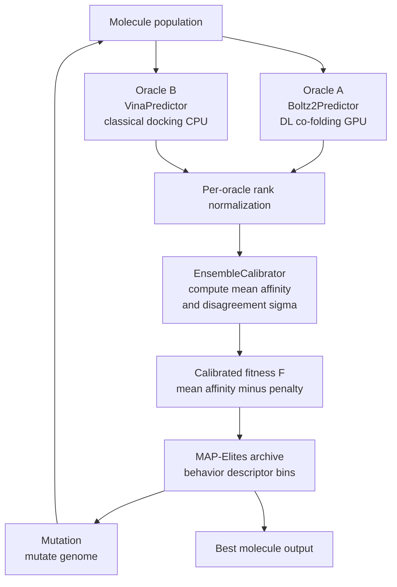

# oraclematch

**Cross-paradigm oracle disagreement as a calibrated fitness penalty for MAP-Elites molecular search.**

> ⚠️ **Pre-alpha (v0.1.0a1).** This release ships the *framework* and a *synthetic, GPU-free
> demonstration* only. It makes **no** drug-discovery or therapeutic-efficacy claim. The
> cross-oracle correlation pilot (KC-2) that gates the scientific novelty claim **has not been
> run** in a GPU environment yet — see [Status & honest limitations](#status--honest-limitations).

---

## What is this?

`oraclematch` is a Python library for evolutionary molecular optimization that uses **two methodologically different scoring oracles** (a deep-learning co-folder and a classical physics docker) and penalizes candidates where those oracles disagree. A molecule that one oracle loves but the other rejects is likely exploiting blind spots — the disagreement penalty pushes it down structurally, not through hand-tuned filters.

The search backbone is **MAP-Elites** (quality-diversity evolutionary search), so the output is an archive of diverse high-fitness candidates rather than a single best molecule.

---

## Architecture



---

## The fitness formula

```
F(x) = ā(x)  −  z · σ_a(x) / √K  −  μ · max(0, δ − c̄(x))
       └ mean ┘   └ disagreement ┘    └ physical-validity gate ┘
        affinity      penalty
```

* `ā(x)` — mean affinity across oracles, **after per-oracle rank-normalization**
* `σ_a(x)` — cross-oracle disagreement; the penalty core
* `c̄(x)` — mean physical/structural confidence (e.g. a PoseBusters pass fraction), `δ` a floor
* `z, μ` — penalty weights (config; intended to be calibrated by the KC-2 pilot)

`σ_a` is computed **only after rank-normalization** — raw scores use different units (log-pIC50-like vs. kcal/mol), so computing disagreement on raw scores would measure unit mismatch, not actual disagreement.

---

## Novelty claim (the only one we make)

> The first OSS to formulate **cross-paradigm oracle disagreement** (DL co-folding × classical
> docking) as an explicit **calibrated fitness penalty** in **MAP-Elites** evolutionary molecular
> search, to structurally suppress single-oracle reward hacking.

### How this differs from prior work

| Prior work | What it does | What it lacks vs. oraclematch |
|---|---|---|
| **DyRAMO** (Nat. Commun. 2025) | QSAR oracles + reliability/applicability-domain thresholds, ChemTSv2 (MCTS) generation | structure-based oracles, cross-model σ penalty, MAP-Elites QD |
| **SynFlowNet + Boltz-2** (bioRxiv 2025.06.14.659707) | Boltz-2 as a GFlowNet reward | a *single* oracle type; no cross-paradigm disagreement; no QD |
| **AlphaDesign** (Mol. Syst. Biol. 2025) | AlphaFold confidence as fitness, standard EA | no docking oracle, no disagreement penalty, no MAP-Elites |
| **REvolve** (arXiv 2406.01309) | LLM-evolved reward functions for RL locomotion | unrelated domain; no molecular oracles |

**Honest caveat:** the claim leans on the MAP-Elites quality-diversity component being meaningfully better than a plain multi-start GA + the same disagreement penalty. The `--ablation` flag compares QD vs. GA on the synthetic landscape; treat its result as a demonstration on synthetic data, not a general claim.

---

## Status & honest limitations

* **No GPU validation yet.** The KC-2 pilot — measuring the Spearman correlation between Boltz-2 and Vina on real complexes — is **deferred to v0.1.1**. It is a prerequisite for any empirical novelty claim. See `scripts/gpu_pilot_kc2.py`.
* **Synthetic only.** All numbers this package can produce today come from the deterministic `MockPredictor` on a synthetic landscape with known ground truth. It demonstrates the *mechanism* behaves as designed; it is **not** evidence about real binding affinity.
* **Real backends provided, not exercised in CI.** `Boltz2Predictor` (GPU) and `VinaPredictor` (CPU) are import-guarded; CI never runs them.

---

## Install

Pre-alpha is installed from the tagged GitHub release (PyPI publishing is planned for v0.1.1):

```bash
pip install "git+https://github.com/hinanohart/oraclematch@v0.1.0a1"          # core (numpy only)
pip install "oraclematch[vina] @ git+https://github.com/hinanohart/oraclematch@v0.1.0a1"   # + Vina (CPU)
pip install "oraclematch[boltz] @ git+https://github.com/hinanohart/oraclematch@v0.1.0a1"  # + Boltz-2 (GPU)
```

The core install is numpy-only and runs the synthetic demo and the full test suite with no GPU.

---

## Quickstart (GPU-free, deterministic)

```bash
oraclematch demo            # runs MAP-Elites with the disagreement penalty on the mock landscape
oraclematch demo --controls # Control A (search efficiency) + Control B (anti-gaming)
oraclematch demo --ablation # QD vs. plain GA comparison on the synthetic landscape
```

```python
from oraclematch.backends import make_oracle_pair
from oraclematch.calibration import EnsembleCalibrator
from oraclematch.evolution import MapElites

dl, dock, w_true = make_oracle_pair(seed=0)
calib = EnsembleCalibrator([dl.oracle_id, dock.oracle_id], z=1.0, mu=1.0, delta=0.5)
me = MapElites([dl, dock], calib, seed=0)
archive = me.run(generations=20, population=32)
print(me.best().fitness)
```

---

## How it works

1. **Backends** — each oracle implements the `Predictor` protocol: `predict(mol)` returns a `PredictionResult` with `affinity` (higher-is-better, sign-normalized) and `confidence` in `[0, 1]`.
2. **Rank normalization** — `oraclematch.core.normalize` maps each oracle's raw affinities to ranks within the current population, making `σ_a` a unit-free disagreement signal.
3. **EnsembleCalibrator** — computes `F(x)` from rank-normalized affinities + confidence values for a batch of molecules.
4. **MapElites** — multi-island MAP-Elites with periodic migration. A 2-D behavior descriptor bins molecules by genome statistics into an `8×8` archive per island. Setting `qd=False` collapses this to a plain (μ+λ) GA for the ablation.
5. **Anti-gaming audit** — `oraclematch.audit.antigaming` provides the caught-rate / FPR methodology for injected single-oracle exploiters (mirrored from the `scorewright` project, reimplemented natively).

---

## Synthetic results (deterministic, `backend="mock"`)

Reproduce with `oraclematch demo --controls --ablation` (all seeds fixed). **These are on the synthetic landscape with known ground truth — a test of the mechanism, not evidence about real binding affinity.**

**Control A — search efficiency** (mean top-5 ground-truth affinity, 12 seeds, paired bootstrap):

| method | mean | vs. `oracle_matched` |
|---|---|---|
| random | 1.47 | — |
| greedy_single (1 oracle) | 1.99 | penalty **> greedy_single** (paired 95% CI excludes 0) |
| ensemble_mean (2 oracles, no penalty) | 2.27 | **no measurable difference** (paired CI spans 0) |
| oracle_matched (2 oracles + penalty) | 2.33 | — |

Honest reading: the disagreement penalty clearly beats naive single-oracle search, but its search-efficiency edge over plain two-oracle averaging is **not** statistically distinguishable on this landscape. The penalty's distinctive value shows up in robustness (Control B), not raw efficiency.

**Control B — anti-gaming** (catch injected single-oracle exploiters; Wilson CIs):

| oracle correlation (emitted as `inter_oracle_spearman_rho`) | caught-rate | FPR |
|---|---|---|
| moderate (`shared=0.5`, ρ≈0.60) | **0.975** [0.87, 0.996] | 0.150 [0.07, 0.29] |
| high (`shared=0.9`, ρ≈0.91) | 0.400 [0.26, 0.55] | 0.050 [0.01, 0.17] |

As the two oracles become more correlated, the disagreement signal weakens and caught-rate collapses — an empirical demonstration of why the KC-2 real-oracle correlation pilot gates the whole method.

---

## Backends

| Backend | Paradigm | Compute | License | In CI |
|---|---|---|---|---|
| `MockPredictor` | synthetic linear | CPU, instant | MIT | ✅ always |
| `VinaPredictor` | classical docking | CPU | MIT (AutoDock-Vina) | ❌ optional extra |
| `Boltz2Predictor` | DL co-folding | GPU (~20 s/ligand) | MIT (Boltz-2) | ❌ optional extra |

---

## Roadmap

* **v0.1.1** — run the KC-2 oracle-correlation pilot on GPU; wire live Boltz-2 + Vina inference.
* **v0.2** — VeriEvolve-Bio: reuse `scorewright`'s evolution/anti-gaming layer; Chai-1/Protenix as additional oracles (K≥3); peptide targets.

---

## License & attribution

MIT. See [`LICENSE`](LICENSE) and [`NOTICE`](NOTICE). Third-party components referenced as optional backends/operators keep their own licenses: Boltz-2 (MIT), AutoDock-Vina (MIT), RDKit (BSD-3-Clause), PoseBusters (BSD-3-Clause), openevolve (MIT). The anti-gaming caught-rate/FPR methodology is inspired by the author's `scorewright` project (MIT); it is reimplemented here natively to avoid cross-repo coupling.
